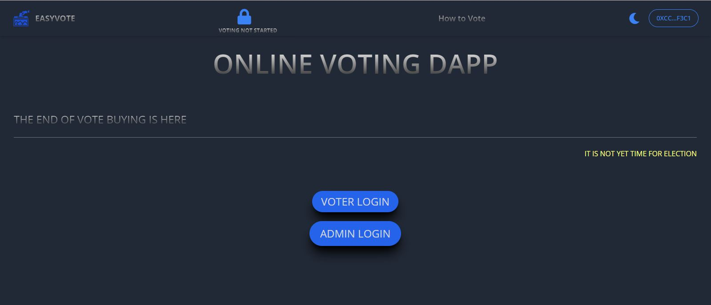
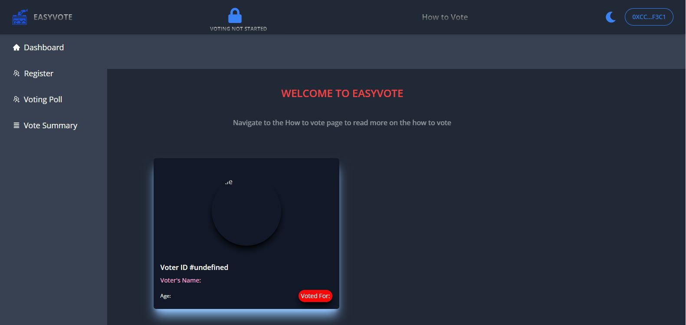
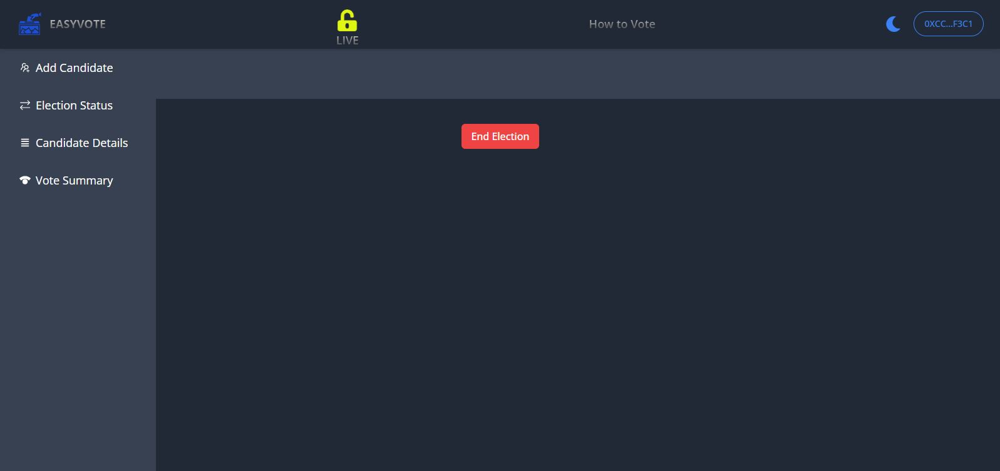

# EsayVote Setup

## This is a Decentralized Voting system

Link to live Demo: [**>>EasyVote**](https://easy-vote-wx6z.vercel.app/)
:



<center><figcaption>EasyVote Login </figcaption></center>



<center><figcaption>Voter Page</figcaption></center>



<center><figcaption>Admin Page</figcaption></center>

## Technology

This Project uses:

- Metamask
- Vite
- Goerli Faucet
- Infuria
- Truffle
- Solidity
- ReactJs
- Tailwind CSS
- Ganache-CLI
- Web3js

## Running the project

To run the program follow these steps:

1. Clone the project with the code below.

   ```sh

   # Make sure you have the above prerequisites installed already!
   git clone https://github.com/LamsyA/EasyVote.git
    # Navigate to the new folder.
   npm install # Installs all the dependencies.
   ```

2. Create an Infuria project, copy and paste your key in the spaces below.
3. Update the `.env` file with the following details.
   ```sh
   ENDPOINT_URL=<PROVIDER_URL>
   SECRET_KEY=<SECRET_PHRASE>
   DEPLOYER_KEY=<YOUR_PRIVATE_KEY>
   ```
4. Run the app using `npm run dev`
   <br/>

## Useful links

- 👀 [Web3Js](https://docs.ethers.io/v5/)
- 🎅 [Faucet](https://faucets.chain.link/rinkeby)
- 🤖 [Ganache](https://trufflesuite.com/ganache/index.html)
  -- 🤖 [Vite](https://vitejs.dev/guide/)
- ✨ [Live Demo](https://easy-vote-wx6z.vercel.app/)
- ⚽ [Metamask](https://metamask.io/)
- 🚀 [Remix Editor](https://remix.ethereum.org/)
- 💡 [Truffle](https://trufflesuite.com/)
- 📈 [Infuria](https://infura.io/)
- 🔥 [ReactJs](https://reactjs.org/)
- 🐻 [Solidity](https://soliditylang.org/)

## Rules of engagement

- Only Admin can start and end the election.
- only admin can add candidate.
- You can only register when the election has note started
- You only vote once

** Once the Admin starts the election the Lock on the
Navbar will be opened to indicate that the poll is opened
for voting **

### How the voting is done on the live demo testnet.

1. Connect Your Metamask and change to Goerli network
2. Login as a user
3. Click on the widget and navigate to the Register page
4. fill all the neccessary information
   Wait for the Admin to start the Election.
   Once the admin starts the election, You will be able to Vote.

Note,For you to be able to register Your age must be 18years and above..

### How the voting is done on the live demo localHost.

1. Connect Your Metamask and change to Local network
2. Login as a user
3. Click on the widget and navigate to the Register page
4. fill all the neccessary information
   Wait for the Admin to start the Election.
   Once the admin starts the election, You will be able to Vote.

Note,For you to be able to register Your age must be 18years and above..
